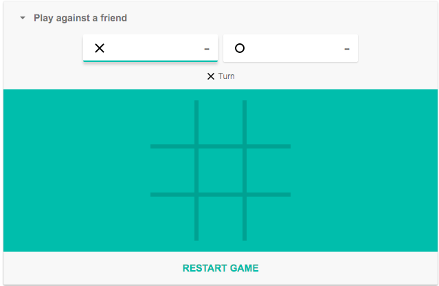

# React TDD Workshop

Welcome to my React TDD workshop!

## Getting started

```bash
# First install the project
npm install

# To run the project
npm start

# To run unit and spec tests
npm test

# To run end to end tests
npm e2e
```

## What is this workshop about?

We will be building the [Tic Tac Toe](https://en.wikipedia.org/wiki/Tic-tac-toe) game, using React + Jest + Puppeteer, all TDD, (almost) without openning the browser!

The end result will be something like this:



## Workshop

Tests are divided to 3 types in this workshop:

1. `.unit.js` - unit tests.
2. `.spec.js` - component tests.
3. `.e2e.js` - browser tests (end to end).

### What we have so far

1. Browser test for starting a new game.
2. Browser test for displaying 'X' after first user click.
3. Browser test for 'X' user winning the game.
4. Component test for displaying 'O' after second user click.
5. Component test for 'O' user winning the game.
6. Winning logic written in a separate method + add unit test for it.

### Workshop tasks

1. Complete game winning logic: write unit tests for the different game winning scenarios (all rows, columns/diagonals/tie).
2. Write a component test (spec) verifying users cannot click the same cell more than once.
3. Write a component test (spec) for a tie (show an "It's a tie!" message).
4. Write a component test that checks that after a win, empty cells are not clickable.
5. Write an e2e test for hiding registration form after game starts.
6. Write an e2e test for starting a new game after clicking "New Game"


### BONUS TASK:
Change the game to 4X4 board using TDD:
   1. Start by disabling/commenting-out all tests besides one.
   2. The test should fail. Change the code to make it work.
   3. Enable another test and refactor again.
   4. Repeat until all tests pass
  
### Advanced puppeteer optional tasks:
* Write a browser test for user saving / loading existing game state (use local storage for that)
* Write a browser test for displaying the number of wins next to each user: Win a game. Press a "new game" button, and win the game again. (Use local storage for that as well)

### Interesting resources

- [puppeteer docs](https://pptr.dev/)
- [puppeteer on devdocs.io](https://devdocs.io/puppeteer/)
- [React testing library](https://testing-library.com/docs/)
- [jest](https://github.com/facebook/jest)
- Puppeteer Egghead [course](https://egghead.io/courses/end-to-end-testing-with-google-s-puppeteer-and-jest)
